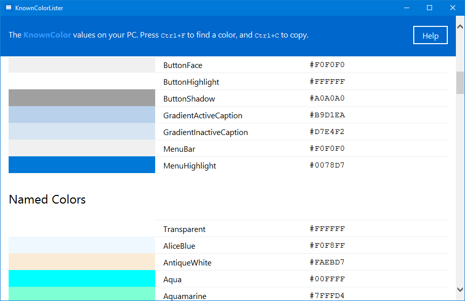

# KnownColorLister
KnownColorLister is a tiny (Hello World) portable Windows program that helps .NET Framework and Windows developers use system-defined colors in their programs. It lists the system colors and their actual values on the current PC, and all the predefined named colors in the .NET Framework.

KnownColorLister is especially useful when using a color picker to look at other user interfaces for color inspiration, as you can easily search for a color code to see if it matches a system-defined color. KnownColorLister features a simple web-like interface, with color tables that show vivid color swatches along with their names and hexadecimal codes. You can press `Ctrl+F` to start searching for a color name or code, or `Ctrl+P` to print the color tables on paper, or to a PDF file. You can also select any color name or code and press `Ctrl+S` to copy it to the clipboard.

## Download

KnownColorLister can be downloaded from [GitHub Releases](https://github.com/TechAurelian/KnownColorLister/releases/latest). You can download the Installation package, or a fully portable edition that does not require installation. KnownColorLister runs on Windows 10, 8, 7, Vista, and XP.

## Source Code

KnownColorLister is written in C# using Windows Forms and .NET Framework 2.0. The project is developed using Microsoft Visual Studio Community 2017, with the help of  and [StyleCop.Analyzers](https://github.com/DotNetAnalyzers/StyleCopAnalyzers).

## Contributions

Contributions are welcome! For feature requests and bug reports please [submit an issue](https://github.com/TechAurelian/KnownColorLister/issues).

## License

KnownColorLister is licensed under the [MIT License](LICENSE).
